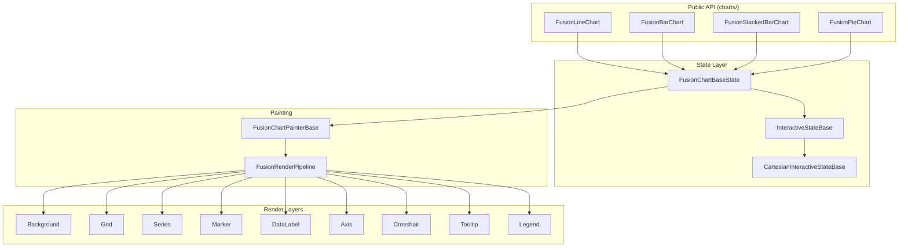
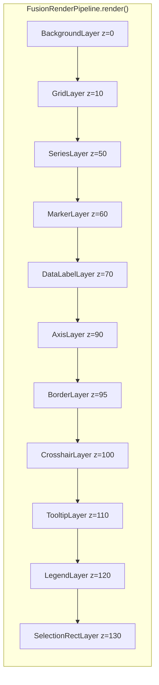
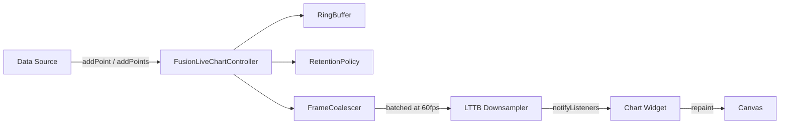
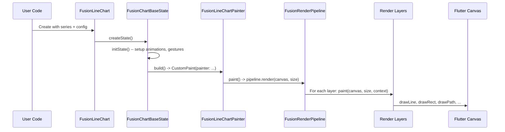
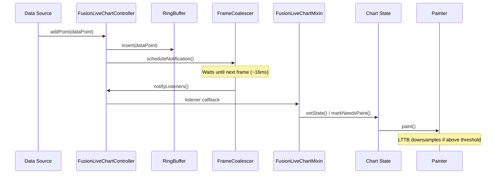
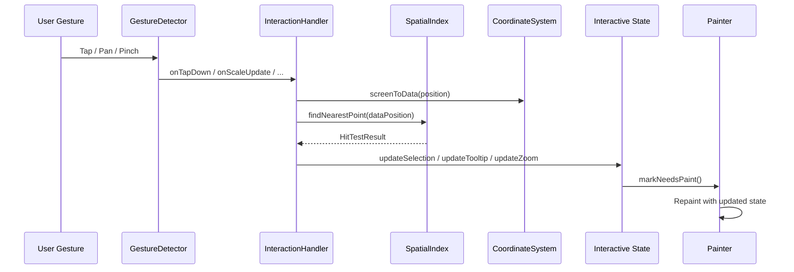
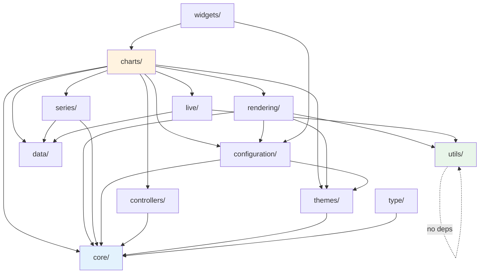

# System Architecture

> **fusion_charts_flutter** -- A high-performance Flutter charting library built on a layered
> composition architecture with pluggable rendering, polymorphic series, and real-time
> streaming support.

This document describes the internal architecture of the library: how widgets, painters,
render layers, series, interactive states, axes, and live-data controllers fit together.
It is aimed at contributors and maintainers who need to understand the system before
making changes.

**Related documentation:**
- `docs/rendering-pipeline.md` -- deep-dive into the layer-based rendering engine
- `docs/live-data-system.md` -- ring buffers, frame coalescing, and LTTB downsampling
- `docs/configuration-reference.md` -- every configuration class and its options
- `docs/theme-system.md` -- theming, light/dark themes, and custom theme creation

---

## Table of Contents

1. [High-Level Overview](#high-level-overview)
2. [Component Relationship Diagram](#component-relationship-diagram)
3. [Widget Hierarchy](#widget-hierarchy)
4. [Rendering Pipeline](#rendering-pipeline)
5. [Series Polymorphism](#series-polymorphism)
6. [Interactive State Hierarchy](#interactive-state-hierarchy)
7. [Axis System](#axis-system)
8. [Coordinate System](#coordinate-system)
9. [Configuration System](#configuration-system)
10. [Live Data System](#live-data-system)
11. [Performance Optimizations](#performance-optimizations)
12. [Theme System](#theme-system)
13. [Data Flow](#data-flow)
14. [Module Dependency Graph](#module-dependency-graph)
15. [Directory Structure](#directory-structure)

---

## High-Level Overview

The library is organized into eleven top-level modules under `lib/src/`:

| Module | Responsibility |
|---|---|
| `charts/` | Public-facing `StatefulWidget` classes and their interactive state machines |
| `configuration/` | Immutable configuration objects (chart, axis, tooltip, zoom, pan, etc.) |
| `controllers/` | Programmatic chart control (`FusionChartController`) |
| `core/` | Axis definitions, enums, models, styling primitives, validation |
| `data/` | Data point classes (`FusionDataPoint`, `FusionBarChartData`, etc.) |
| `live/` | Real-time streaming: ring buffer, frame coalescer, downsampler, retention |
| `rendering/` | Painters, render pipeline, layers, coordinate system, hit testing |
| `series/` | Abstract `FusionSeries` and concrete series types with mixins |
| `themes/` | Abstract `FusionChartTheme` plus light and dark implementations |
| `type/` | Shared type definitions (`FusionGradient`) |
| `utils/` | Standalone utilities (math, formatting, color palette, responsive sizing) |
| `widgets/` | Reusable widget helpers (error boundary, scroll intercept, zoom controls) |

The architecture follows a strict layered dependency rule: higher-level modules depend on
lower-level ones, never the reverse. `utils/` has zero cross-module dependencies and sits
at the bottom of the stack.

---

## Component Relationship Diagram



---

## Widget Hierarchy

Every chart type follows the same structural pattern:

```
StatefulWidget (FusionLineChart, FusionBarChart, etc.)
  +-- State (FusionChartBaseState) with TickerProviderStateMixin
      +-- CustomPaint
          +-- CustomPainter (FusionLineChartPainter, etc.)
              +-- FusionChartPainterBase (abstract)
```

### Key classes

| Class | File | Role |
|---|---|---|
| `FusionChartBase` | `charts/base/fusion_chart_base.dart` | Abstract widget base; holds series, config, axes |
| `FusionChartBaseState` | `charts/base/fusion_chart_base_state.dart` | State with `TickerProviderStateMixin`; owns animation controllers, gesture wiring, layout |
| `FusionChartPainterBase` | `rendering/fusion_chart_painter_base.dart` | Abstract `CustomPainter`; delegates to `FusionRenderPipeline` |

`TickerProviderStateMixin` is used (rather than `SingleTickerProviderStateMixin`) because
charts may run multiple concurrent animations -- entry animation, zoom animation, tooltip
fade, and crosshair transitions can all overlap.

### Widget instantiation flow

1. The user creates `FusionLineChart(series: [...], configuration: ...)`.
2. `FusionChartBaseState.build()` wraps a `GestureDetector` around a `CustomPaint`.
3. The `CustomPainter` receives the current interactive state snapshot and calls
   `FusionRenderPipeline.render()` on every frame.
4. `shouldRepaint()` compares the previous and current state snapshots to avoid
   unnecessary repaints.

---

## Rendering Pipeline

The rendering engine uses a **composition pattern** where independent visual concerns are
separated into discrete layers, each with its own z-index, cacheability flag, and
`shouldRepaint()` check.



### Layer base class

All layers extend `FusionRenderLayer` (defined in `rendering/layers/fusion_render_layer.dart`):

```dart
abstract class FusionRenderLayer {
  final String name;
  final int zIndex;
  bool enabled;
  final bool cacheable;

  void paint(Canvas canvas, Size size, FusionRenderContext context);
  void paintWithCache(Canvas canvas, Size size, FusionRenderContext context);
  bool shouldRepaint(covariant FusionRenderLayer oldLayer);
  void invalidateCache();
  void dispose();
}
```

Cacheable layers (e.g., `FusionBackgroundLayer`) record their output into a `Picture`
and replay it on subsequent frames until `invalidateCache()` is called. This avoids
redundant draw calls for static content.

### Layer inventory

| Layer | z-Index | Cacheable | Description |
|---|---|---|---|
| `FusionBackgroundLayer` | 0 | Yes | Solid color or gradient background |
| `FusionGridLayer` | 10 | No | Major and minor grid lines, clipped to chart area |
| `FusionSeriesLayer` | 50 | No | Delegates to series-specific renderers |
| `FusionMarkerLayer` | 60 | No | Data point markers (circle, square, triangle, etc.) |
| `FusionDataLabelLayer` | 70 | No | In-chart data labels with collision avoidance |
| `FusionAxisLayer` | 90 | No | Axis lines, tick marks, labels, and titles |
| `FusionBorderLayer` | 95 | No | Chart area border |
| `FusionCrosshairLayer` | 100 | No | Vertical/horizontal crosshair lines |
| `FusionTooltipLayer` | 110 | No | Tooltip rendering (also stacked and pie variants) |
| `FusionLegendLayer` | 120 | No | Interactive legend |
| `FusionSelectionRectLayer` | 130 | No | Zoom selection rectangle |

### Series-specific renderers

The `FusionSeriesLayer` does not draw data itself. It delegates to specialized renderers:

| Renderer | File | Draws |
|---|---|---|
| `FusionBarSeriesRenderer` | `rendering/layers/fusion_bar_series_renderer.dart` | Grouped bar/column charts |
| `FusionStackedBarSeriesRenderer` | `rendering/layers/fusion_stacked_bar_series_renderer.dart` | Stacked bar/column charts |

Line and area series are rendered directly within the painter using `FusionPathBuilder`
for efficient path construction.

### Render context

Every layer receives a `FusionRenderContext` that bundles:

- `chartArea` (the drawable `Rect` after margins)
- `coordSystem` (the current `FusionCoordinateSystem`)
- `theme` (active `FusionChartTheme`)
- Axis configurations and definitions
- Paint pool access (`getPaint()` / `returnPaint()`)
- Convenience coordinate transforms (`dataXToScreenX()`, `dataYToScreenY()`)

---

## Series Polymorphism

Series classes follow the **Liskov Substitution Principle**: any `FusionSeries` subclass
can be used wherever the base type is expected.

```
FusionSeries (abstract, @immutable)
  |-- FusionLineSeries      (+ gradient, marker, shadow, dataLabel, animation mixins)
  |-- FusionAreaSeries       (+ gradient, marker, shadow, dataLabel, animation mixins)
  |-- FusionBarSeries        (+ gradient, dataLabel mixins)
  |-- FusionStackedBarSeries (+ gradient, dataLabel mixins)
  |-- FusionPieSeries        (+ dataLabel mixins)
```

### Common properties (from `FusionSeries`)

| Property | Type | Description |
|---|---|---|
| `name` | `String` | Display name for legends and tooltips |
| `color` | `Color` | Primary series color |
| `visible` | `bool` | Toggle visibility without removing the series |

### Mixin composition

Rather than deep inheritance, visual features are composed via Dart mixins. This keeps
each series lean -- a `FusionBarSeries` does not carry marker or shadow overhead, while
a `FusionLineSeries` gets all of them.

### Data binding

Series are paired with data through the `SeriesWithDataPoints<S, D>` generic wrapper
defined in `series/series_with_data_points.dart`. This separates the series visual
definition from the data it renders, enabling the same series to be rebound to
different data sets.

---

## Interactive State Hierarchy

Interaction handling uses the **Template Method** pattern. The base class defines the
gesture-handling skeleton; subclasses fill in chart-type-specific behavior (hit testing,
tooltip data extraction, selection semantics).

```
FusionInteractiveStateBase (abstract)
  +-- FusionCartesianInteractiveStateBase<TTooltipData>
      |-- FusionInteractiveChartState (line/area charts)
      |-- FusionBarInteractiveState
      |-- FusionStackedBarInteractiveState
      +-- FusionPieInteractiveState
```

Additionally, `FusionBarInteractiveStateBase` provides shared bar-chart hit-testing logic
that both `FusionBarInteractiveState` and `FusionStackedBarInteractiveState` extend.

### Cartesian base capabilities

`FusionCartesianInteractiveStateBase` handles:

- Zoom (pinch and selection rectangle) via `FusionZoomAnimationMixin`
- Pan (drag with momentum and edge clamping)
- Crosshair tracking
- Tooltip activation (tap, long-press, hover)
- Coordinate system management during viewport changes
- Animation orchestration for smooth transitions

### Chart-specific state classes

| Class | Chart Types | Key Additions |
|---|---|---|
| `FusionInteractiveChartState` | Line, Area | Nearest-point hit testing, multi-series tooltip aggregation |
| `FusionBarInteractiveState` | Bar | Rectangle hit testing via `FusionBarHitTester` |
| `FusionStackedBarInteractiveState` | Stacked Bar | Stacked segment hit testing via `FusionStackedBarHitTester` |
| `FusionPieInteractiveState` | Pie | Polar angle hit testing, explode-on-tap |

### State mixins

| Mixin | File | Purpose |
|---|---|---|
| `FusionZoomAnimationMixin` | `charts/mixins/fusion_zoom_animation_mixin.dart` | Animated zoom transitions |
| `FusionLiveChartMixin` | `charts/mixins/fusion_live_chart_mixin.dart` | Wiring for live data controllers |

---

## Axis System

The axis system uses a **Factory + Strategy** pattern. Axis definitions describe the
data domain; axis renderers know how to calculate bounds and generate labels.

### Axis definitions

```
FusionAxisBase (abstract)
  |-- FusionNumericAxis
  |-- FusionCategoryAxis
  +-- FusionDateTimeAxis
```

Each axis type stores domain-specific information:

| Axis | Key Properties |
|---|---|
| `FusionNumericAxis` | `minimum`, `maximum`, `interval` |
| `FusionCategoryAxis` | `categories` (list of string labels) |
| `FusionDateTimeAxis` | `minimum`, `maximum` (as `DateTime`), auto-interval |

### Axis renderers

Created by `FusionAxisRendererFactory.create()`:

| Renderer | File | Strategy |
|---|---|---|
| `NumericAxisRenderer` | `core/axis/numeric/numeric_axis_renderer.dart` | Nice-number interval calculation |
| `CategoryAxisRenderer` | `core/axis/category/category_axis_renderer.dart` | Evenly spaced discrete labels |
| `FusionDateTimeAxisRenderer` | `core/axis/datetime/fusion_datetime_axis_renderer.dart` | Time-aware interval selection |

All renderers implement the `FusionAxisRenderer` interface:

```dart
abstract class FusionAxisRenderer {
  AxisBounds calculateBounds(List<double> dataValues);
  List<AxisLabel> generateLabels(AxisBounds bounds);
  void dispose();
}
```

### Axis configuration

Visual properties (colors, widths, label styles, tick marks, grid lines, titles) are
controlled by `FusionAxisConfiguration`, independent of the axis type. This separation
means the same configuration object works for numeric, category, and datetime axes.

---

## Coordinate System

`FusionCoordinateSystem` is an **immutable** value object that encapsulates the mapping
between data space and screen space.

**Location:** `rendering/fusion_coordinate_system.dart`

### Properties

| Property | Description |
|---|---|
| `chartArea` | The screen `Rect` available for drawing data |
| `dataXMin` / `dataXMax` | Visible data range on the X axis |
| `dataYMin` / `dataYMax` | Visible data range on the Y axis |
| `scaleX` / `scaleY` | Precomputed pixels-per-data-unit ratios |

### Transforms

```dart
double dataXToScreenX(double dataX);  // data -> pixel
double dataYToScreenY(double dataY);  // data -> pixel (Y is inverted)
double screenXToDataX(double screenX); // pixel -> data
double screenYToDataY(double screenY); // pixel -> data
```

Because the coordinate system is immutable, it can be safely shared across layers within
a single paint call. A new instance is created whenever the viewport changes (zoom, pan,
resize).

---

## Configuration System

Configuration uses an **inheritance** pattern where chart-type-specific configurations
extend a shared base.

```
FusionChartConfiguration (base)
  |-- FusionLineChartConfiguration
  |-- FusionBarChartConfiguration
  |-- FusionStackedBarChartConfiguration
  +-- FusionPieChartConfiguration
```

### Base configuration properties

`FusionChartConfiguration` provides options shared by all chart types:

- `enableZoom`, `enablePanning`, `enableCrosshair`
- `zoomConfiguration`, `panConfiguration`, `crosshairConfiguration`
- `tooltipConfiguration`, `legendConfiguration`
- `backgroundColor`, `borderColor`
- `animationDuration`, `animationCurve`
- `title`, `subtitle`

### Chart-type extensions

Each subclass adds chart-specific options (e.g., `FusionLineChartConfiguration` adds
`showMarkers`, `lineWidth`; `FusionBarChartConfiguration` adds `barWidth`, `cornerRadius`;
`FusionPieChartConfiguration` adds `innerRadius`, `startAngle`).

### Sub-configurations

Feature-specific behavior is delegated to dedicated configuration objects:
`FusionZoomConfiguration`, `FusionPanConfiguration`, `FusionCrosshairConfiguration`,
`FusionTooltipConfiguration`, `FusionLegendConfiguration`, and `FusionAxisConfiguration`.

---

## Live Data System

The live data system enables real-time chart streaming with efficient memory management
and frame-rate-aware batching.



### Core components

| Component | File | Responsibility |
|---|---|---|
| `FusionLiveChartController` | `live/fusion_live_chart_controller.dart` | Central controller; extends `ChangeNotifier` |
| `RingBuffer<T>` | `live/ring_buffer.dart` | O(1) append/remove circular buffer with fixed capacity |
| `RetentionPolicy` | `live/retention_policy.dart` | Automatic eviction by count, age, or memory |
| `FrameCoalescer` | `live/frame_coalescer.dart` | Batches rapid updates to a single notification per frame |
| LTTB downsampler | `utils/lttb_downsampler.dart` | Largest-Triangle-Three-Buckets algorithm for visual fidelity |

### Data flow

1. External code calls `controller.addPoint(point)` or `controller.addPoints(batch)`.
2. The point is inserted into the `RingBuffer`. If the buffer is full, the oldest point
   is silently evicted.
3. `RetentionPolicy` may additionally trim points older than a threshold.
4. `FrameCoalescer` absorbs the notification. If multiple points arrive within one frame
   (~16ms), they are coalesced into a single `notifyListeners()` call.
5. The chart widget, listening via `FusionLiveChartMixin`, marks itself dirty.
6. On the next paint, the LTTB downsampler reduces the buffer to the target display
   point count while preserving visual shape.

### Configuration options

| Option | Description |
|---|---|
| `bufferCapacity` | Maximum points in the ring buffer |
| `retentionPolicy` | Time-based or count-based eviction rules |
| `downsampleThreshold` | Point count above which LTTB activates |
| `duplicateTimestampBehavior` | Replace, keep, or reject duplicate timestamps |
| `outOfOrderBehavior` | Sort, reject, or accept out-of-order timestamps |
| `liveViewportMode` | Auto-scroll, fixed window, or manual viewport |

---

## Performance Optimizations

The rendering engine includes several performance subsystems to maintain 60fps on large
data sets.

### Paint object pooling

**Class:** `FusionPaintPool` (`rendering/engine/fusion_paint_pool.dart`)

`Paint` objects are expensive to create and garbage-collect. The pool maintains a
free-list of pre-configured `Paint` instances. Layers call `context.getPaint()` and
`context.returnPaint()` instead of allocating.

### Shader caching

**Class:** `FusionShaderCache` (`rendering/engine/fusion_shader_cache.dart`)

Gradient shaders are cached by their parameters. When a series gradient has not changed
between frames, the cached shader is reused instead of calling `createShader()`.

### Render optimization

**Class:** `FusionRenderOptimizer` (`rendering/engine/fusion_render_optimizer.dart`)

Tracks which layers have changed between frames. Unchanged layers can skip their
`paint()` call entirely when their `shouldRepaint()` returns `false`.

### Spatial indexing

**Class:** `FusionSpatialIndex` (`rendering/interaction/fusion_spatial_index.dart`)

Uses a **QuadTree** for O(log n) hit testing. When the user taps the chart, the spatial
index narrows down candidate data points without scanning every point in every series.

### Clipping management

**Class:** `FusionClippingManager` (`rendering/engine/fusion_clipping_manager.dart`)

Manages efficient clip regions so that series data, grid lines, and other content do not
overflow the chart area during zoom/pan. Nested save/restore calls are minimized.

### Layer caching

The `FusionRenderLayer` base class supports `Picture`-based caching. Layers marked
`cacheable: true` record their draw commands into a `Picture` and replay it on subsequent
frames. The cache is invalidated only when the layer's inputs change.

---

## Theme System

Themes provide consistent visual styling across all chart elements.

```
FusionChartTheme (abstract)
  |-- FusionLightTheme
  +-- FusionDarkTheme
```

**Location:** `themes/`

### Theme properties

A theme defines colors, text styles, and dimensions for every visual element:

| Category | Examples |
|---|---|
| Colors | `backgroundColor`, `gridColor`, `axisColor`, `borderColor`, `tooltipBackground` |
| Text styles | `axisLabelStyle`, `tooltipTextStyle`, `legendTextStyle`, `titleStyle` |
| Dimensions | `gridLineWidth`, `axisLineWidth`, `tooltipBorderRadius` |
| Series palette | Default color sequence for auto-coloring series |

### Usage

Themes are resolved through `FusionRenderContext.theme`. If no theme is explicitly set,
`FusionLightTheme` is used by default. Custom themes extend `FusionChartTheme` and
override the desired properties.

---

## Data Flow

### Static chart rendering



### Live chart streaming



### User interaction



---

## Module Dependency Graph



**Dependency rules:**

| Module | Depends on | Never depends on |
|---|---|---|
| `charts/` | `configuration/`, `series/`, `rendering/`, `controllers/`, `live/` | -- (top of stack) |
| `rendering/` | `configuration/`, `core/axis/`, `themes/`, `utils/` | `charts/`, `live/` |
| `series/` | `data/`, `core/enums/` | `rendering/`, `charts/` |
| `configuration/` | `core/enums/`, `themes/` | `rendering/`, `charts/` |
| `live/` | `utils/` (ring_buffer, retention_policy, downsampler are internal) | `rendering/`, `charts/` |
| `utils/` | (none) | everything |
| `core/` | (none -- mostly self-contained) | everything except `themes/` for styling |

---

## Directory Structure

```
lib/src/
  charts/           # Public widgets + interactive state machines (22 files)
    base/           #   Abstract bases: FusionChartBase, FusionChartBaseState, interactive states
    mixins/         #   FusionZoomAnimationMixin, FusionLiveChartMixin
    pie/            #   Pie chart widget, painter, and interactive state
  configuration/    # Immutable config objects (11 files)
  controllers/      # FusionChartController for programmatic control
  core/             # Foundational types (30+ files)
    axis/           #   Axis definitions + renderers (numeric, category, datetime)
    enums/          #   15+ enums (zoom mode, pan mode, marker shape, etc.)
    models/         #   AxisBounds, AxisLabel, MinorGridLines, etc.
    constants/      #   AxisDefaults
    styling/        #   AxisLine, MajorTickLines
    features/       #   PlotBand
    validation/     #   DataValidator, NullHandler
  data/             # Data point classes (4 files)
  live/             # Real-time streaming subsystem (10 files)
  rendering/        # Paint engine and visual layers (25+ files)
    engine/         #   Pipeline, context, optimizer, paint pool, shader cache, clipping
    layers/         #   All render layer implementations
    painters/       #   Chart-type-specific CustomPainter subclasses
    interaction/    #   FusionSpatialIndex (QuadTree)
    layout/         #   ChartLayout, ChartLayoutManager
    polar/          #   Pie segment geometry, polar math
  series/           # Abstract FusionSeries + concrete types (7 files)
  themes/           # FusionChartTheme, light + dark implementations (3 files)
  type/             # FusionGradient
  utils/            # Standalone utilities -- zero cross-module deps (13 files)
  widgets/          # Error boundary, scroll intercept, zoom controls
```

The codebase contains **149 Dart files** across these modules. The public barrel export
is `lib/fusion_charts_flutter.dart`.

---

## Design Patterns Summary

| Pattern | Where Used | Purpose |
|---|---|---|
| **Composition** | Render pipeline + layers | Separate visual concerns into independent, reorderable layers |
| **Template Method** | Interactive state hierarchy | Define gesture-handling skeleton; subclasses fill in specifics |
| **Factory** | `FusionAxisRendererFactory` | Create axis renderers based on axis type |
| **Strategy** | Axis renderers | Interchangeable label/bound calculation algorithms |
| **Observer** | `FusionLiveChartController` (ChangeNotifier) | Decouple data producers from chart consumers |
| **Object Pool** | `FusionPaintPool` | Reuse `Paint` objects to reduce GC pressure |
| **Spatial Index** | `FusionSpatialIndex` (QuadTree) | O(log n) hit testing for large data sets |
| **Ring Buffer** | `RingBuffer<T>` | O(1) bounded append for streaming data |
| **Immutable Value** | `FusionCoordinateSystem`, configurations | Thread-safe sharing, easy equality checks |
| **Mixin Composition** | Series features (gradient, marker, shadow) | Flexible feature composition without deep inheritance |
